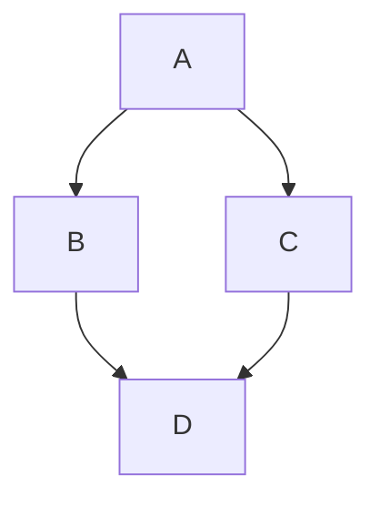

# Obsidian Markdown Cheat Sheet
## Headings

```markdown
# header 1
## header 2
### header 3

etc...
```

## Styling text

| Style                  | Example                | Output                                   |                                        |
| ---------------------- | ---------------------- | ---------------------------------------- | -------------------------------------- |
| Bold                   | `** **` or `__ __`     | `**Bold text**`                          | **Bold text**                          |
| Italic                 | `* *` or `_ _`         | `*Italic text*`                          | _Italic text_                          |
| Strikethrough          | `~~ ~~`                | `~~Striked out text~~`                   | ~~Striked out text~~                   |
| Bold and nested italic | `** **` and `_ _`      | `**Bold text and _nested italic_ text**` | **Bold text and _nested italic_ text** |
| Bold and italic        | `*** ***` or `___ ___` | `***Bold and italic text***`             | **_Bold and italic text_**             |
| Highlight              | `== ==`                | ```markdown ==Highlighted text== ```     | ==Hightlighted text==                  |

## Quotes

You can quote text by adding a `>` symbols before the text.

```markdown
> Human beings face ever more complex and urgent problems, and their effectiveness in dealing with these problems is a matter that is critical to the stability and continued progress of society.
> 
> - Doug Engelbart, 1961
```

> Human beings face ever more complex and urgent problems, and their effectiveness in dealing with these problems is a matter that is critical to the stability and continued progress of society.
> 
> - Doug Engelbart, 1961

## Callouts

```markdown
> [!info] Callout title
> Content of callout
```

> [!summary] Callout title (summary, abstract, tldr)
> Content of 

> [!tip] Callout title (tip, hint, important)
> Content of 

> [!note] Callout title (note)
> Content of 

> [!info] Callout title (info)
> Content of 

> [!todo] Callout title (todo)
> Content of 

> [!question] Callout title (question, help, faq)
> Content of 

> [!warning] Callout title (warning, caution, attention)
> Content of 

> [!fail] Callout title (fail, failture, missing)
> Content of 

> [!bug] Callout title (bug)
> Content of 

> [!example] Callout title (example)
> Content of 

> [!quote] Callout title (quote, cite)
> Content of 

### Foldable callouts

You can make a callout foldable by adding a plus (+) or a minus (-) directly after the type identifier.

A plus sign expands the callout by default, and a minus sign collapses it instead.

```markdown
> [!faq]- Are callouts foldable?
> Yes! In a foldable callout, the contents are hidden when the callout is collapsed.
```

> [!faq]- Are callouts foldable?
> Yes! In a foldable callout, the contents are hidden when the callout is collapsed.

## Mermaid diagramms

```
graph TD;
    A-->B;
    A-->C;
    B-->D;
    C-->D;
```



## Tables

Name|Position|Date|Score 
--|--|--|--
John|CTO|2022-12-12|98

## Formulas
$$ a = b^2 $$
```
	$$ a = b^2 $$
```

Inline: $a=b^2$

```
Inline: $a=b^2$
```

## More tricks

Indenting text with a preceding blank lines is rendered as ==code block== (which is why it changes color, which gets asked quite often).

```
==code block==
```

- To get a line break in a Markdown table, use `<br>`.

## Embedded files and videos


```

```