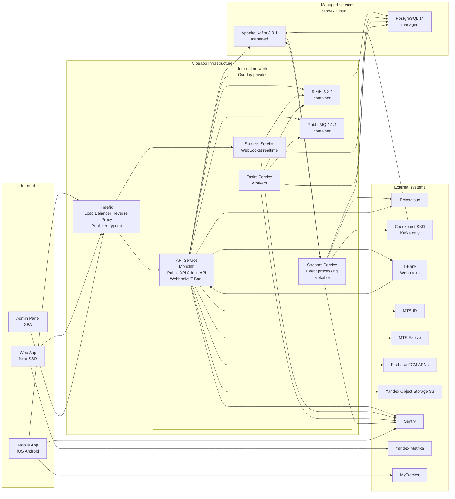

[[Vibeapp]] - [[Vibeapp — Архитектура проекта|Архитектура проекта]]

### Edge / публичный вход

- Публично опубликован только **Traefik** (HTTPS).
- Traefik маршрутизирует:
    - HTTP(S) на **API Service**
    - WebSocket на **Sockets Service** (в рамках того же домена).

- **Webhooks принимает только API Service от T-Bank**.

### Внутренний контур (Docker Swarm)

Контейнеры во внутренней сети (без публичных портов):

- **API Service (монолит)** — Public API + Admin API + webhooks T-Bank.
- **Sockets Service** — realtime (WS) за Traefik.
- **Tasks Service** — воркеры (RabbitMQ consumers).
- **Streams Service** — обработка событий / интеграционные потоки через Kafka (aiokafka).
- **Redis (container)**, **RabbitMQ (container)**.

### Managed сервисы (Yandex Cloud)

- **PostgreSQL 14 (managed)**
- **Apache Kafka 3.9.1 (managed)** — транспорт для интеграционных потоков, в том числе:
    - Vibeapp → Checkpoint (смена владельца билета)
    - Checkpoint → Vibeapp (погашение билета)
    - Vibeapp → Ticketscloud (смена владельца билета)
    - Ticketscloud → Vibeapp (билеты, мероприятия, возвраты)

### Внешние системы

- Ticketcloud, Checkpoint, T-Bank, MTS ID, MTS Exolve, Firebase, Yandex Object Storage, Sentry, Yandex Metrika, MyTracker — используются по публичным API/SDK.