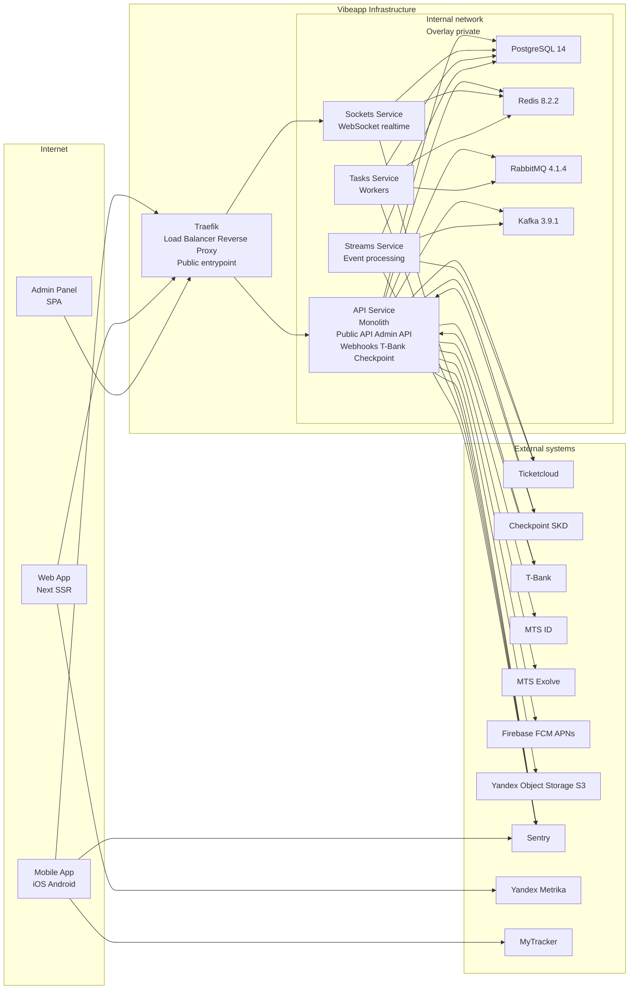

[[Vibeapp]] - [[Vibeapp — Архитектура проекта|Архитектура проекта]]

```mermaid
flowchart LR

  subgraph Internet["Internet"]
    Mobile["Mobile App
iOS Android"]
    WebApp["Web App
Next SSR"]
    AdminUI["Admin Panel
SPA"]
  end

  subgraph Swarm["Vibeapp Infrastructure
Docker Swarm Cluster"]
    Traefik["Traefik
Load Balancer Reverse Proxy
Public entrypoint"]

    subgraph PrivateNet["Internal network
Overlay private"]
      API["API Service
Monolith
Public API Admin API
Webhooks T-Bank Checkpoint"]
      Sockets["Sockets Service
WebSocket realtime"]
      Tasks["Tasks Service
Workers"]
      Streams["Streams Service
Event processing"]

      PG["PostgreSQL 14"]
      Redis["Redis 8.2.2"]
      RMQ["RabbitMQ 4.1.4"]
      Kafka["Kafka 3.9.1"]
    end
  end

  subgraph External["External systems"]
    Ticketcloud["Ticketcloud"]
    Checkpoint["Checkpoint SKD"]
    TBank["T-Bank"]
    MTSID["MTS ID"]
    Exolve["MTS Exolve"]
    Firebase["Firebase FCM APNs"]
    Storage["Yandex Object Storage S3"]
    Sentry["Sentry"]
    Metrika["Yandex Metrika"]
    MyTracker["MyTracker"]
  end

  Mobile --> Traefik
  WebApp --> Traefik
  AdminUI --> Traefik

  Traefik --> API
  Traefik --> Sockets

  API --> PG
  API --> Redis
  API --> RMQ
  API --> Kafka

  Sockets --> Redis
  Sockets --> PG

  Tasks --> RMQ
  Tasks --> PG
  Tasks --> Redis

  Streams --> Kafka
  Streams --> PG

  API --> Ticketcloud
  Streams --> Ticketcloud

  API --> Checkpoint
  Checkpoint --> API

  API --> TBank
  TBank --> API

  API --> MTSID
  API --> Exolve
  API --> Firebase
  API --> Storage

  API --> Sentry
  Sockets --> Sentry
  Tasks --> Sentry
  Streams --> Sentry

  Mobile --> MyTracker
  WebApp --> Metrika
  Mobile --> Sentry
```
