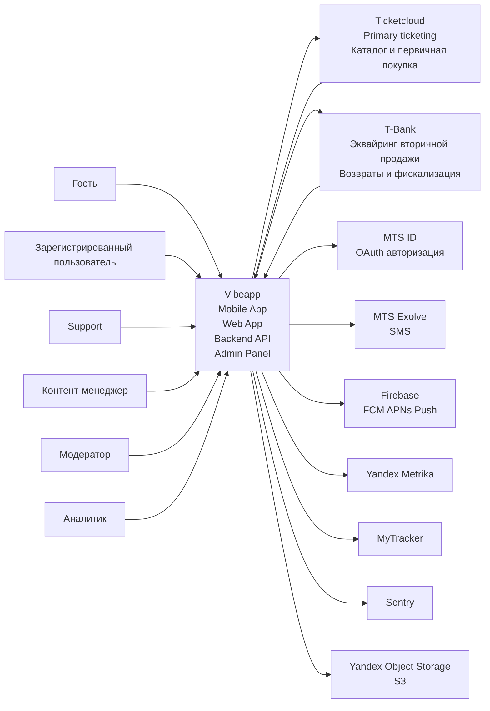

[[Vibeapp]]

## Level 1

**Vibeapp** — B2C система (Mobile App + Web App + Backend/API + Admin Panel), обеспечивающая:
- первичную работу с билетами (через Ticketcloud)
- передачу билетов,
- вторичную перепродажу (через T-Bank эквайринг),
- знакомства и общение (собственная реализация),
- offline-first доступ с последующей синхронизацией.

### Роли
- Гость — просмотр/онбординг/старт регистрации.
- Зарегистрированный пользователь — покупка/хранение/передача/перепродажа билетов, знакомства/чат, получение уведомлений.
- Support / Контент-менеджер / Модератор / Аналитик — работают через Admin Panel.

### Внешние системы и связи

**Ticketcloud**
- **Ticketcloud** → **Vibeapp**: мероприятия (каталог), билеты пользователя/данные билетов, статусы первичных операций.
- **Vibeapp** → **Ticketcloud**: операции первичной покупки и возврата первички (обрабатываются в Ticketcloud), а также синхронизация ownership после операций, выполненных в Vibeapp.
- **Ownership flow**: сначала меняется в Vibeapp, затем синхронизируется в Ticketcloud (включая передачу и перепродажу).

**T-Bank** (платежная система, вторичная продажа)
- **Vibeapp** → **T-Bank**: создание заказа/платежа для вторичной продажи (эквайринг), запросы на возвраты вторички, сверка, фискализация (если применимо).
- **T-Bank** → **Vibeapp**: подтверждения и webhooks статусов (платёж/возврат/фискализация).

**MTS ID** (OAuth)
- **Vibeapp** ↔ **MTS ID**: авторизация пользователей по OAuth (на основе телефона/учётных данных провайдера).

**MTS Exolve** (SMS)
- **Vibeapp** → **MTS Exolve**: отправка SMS (OTP/сервисные сообщения).

**Firebase** (FCM/APNs)
- **Vibeapp** → **Firebase**: регистрация токенов устройств и отправка push payload.

**Yandex Metrika / MyTracker**
- **Vibeapp** → **Analytics**: события приложения и продуктовые метрики.

**Sentry**
- Vibeapp → Sentry: ошибки/логи/трейсы.

**Yandex Object Storage (S3)**
- Vibeapp → Storage: хранение и выдача аватарок/медиа.

### Границы системы

**Внутри границы Vibeapp**: mobile/web клиенты, backend/API, admin panel, чат/знакомства, логика передачи/вторичной продажи и смены ownership, offline-first и синхронизация.

**Вне границы**: Ticketcloud (первичка и возвраты первички + внешний реестр/синх ownership), T-Bank (эквайринг вторички + возвраты/фискализация + webhooks), MTS ID/Exolve, Firebase, Metrika/MyTracker, Sentry, Yandex Storage.