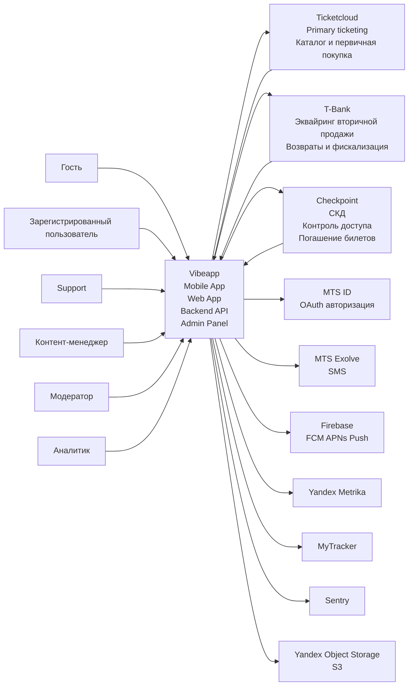
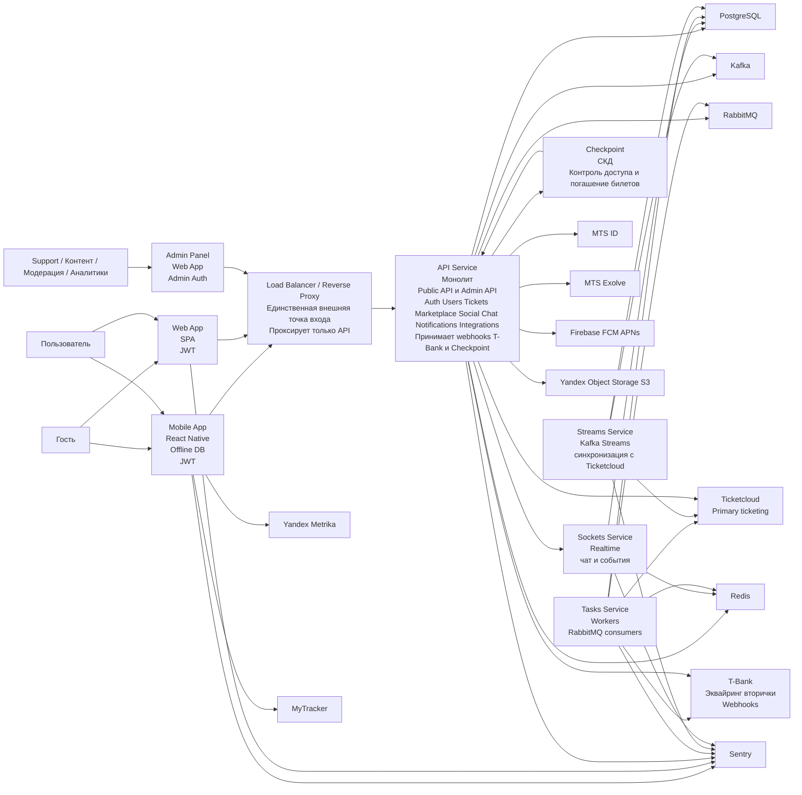

[[Vibeapp]] - [[Vibeapp — Архитектура проекта|Архитектура проекта]]

[[Vibeapp - технологический стек|Технологический стек]]

## Level 1

**Vibeapp** — B2C система (Mobile App + Web App + Backend/API + Admin Panel), обеспечивающая:
- первичную работу с билетами (через Ticketcloud)
- передачу билетов,
- вторичную перепродажу (через T-Bank эквайринг),
- знакомства и общение (собственная реализация),
- offline-first доступ с последующей синхронизацией.

### Роли
- Гость — просмотр/онбординг/старт регистрации.
- Зарегистрированный пользователь — покупка/хранение/передача/перепродажа билетов, знакомства/чат, получение уведомлений.
- Support / Контент-менеджер / Модератор / Аналитик — работают через Admin Panel.

### Внешние системы и связи

**Ticketcloud**
- **Ticketcloud** → **Vibeapp**: мероприятия (каталог), билеты пользователя/данные билетов, статусы первичных операций.
- **Vibeapp** → **Ticketcloud**: операции первичной покупки и возврата первички (обрабатываются в Ticketcloud), а также синхронизация ownership после операций, выполненных в Vibeapp.
- **Ownership flow**: сначала меняется в Vibeapp, затем синхронизируется в Ticketcloud (включая передачу и перепродажу).

**Checkpoint (СКД — система контроля доступа)**
Внешняя система контроля доступа на мероприятиях.
- **Vibeapp → Checkpoint**: передача данных о смене владельца билета (передача или перепродажа, актуализация права доступа).
- **Checkpoint → Vibeapp**: уведомления о **погашении билета** (факт прохода), используемые для обновления статуса билета внутри системы.

**T-Bank** (платежная система, вторичная продажа)
- **Vibeapp** → **T-Bank**: создание заказа/платежа для вторичной продажи (эквайринг), запросы на возвраты вторички, сверка, фискализация (если применимо).
- **T-Bank** → **Vibeapp**: подтверждения и webhooks статусов (платёж/возврат/фискализация).

**MTS ID** (OAuth)
- **Vibeapp** ↔ **MTS ID**: авторизация пользователей по OAuth (на основе телефона/учётных данных провайдера).

**MTS Exolve** (SMS)
- **Vibeapp** → **MTS Exolve**: отправка SMS (OTP/сервисные сообщения).

**Firebase** (FCM/APNs)
- **Vibeapp** → **Firebase**: регистрация токенов устройств и отправка push payload.

**Yandex Metrika / MyTracker**
- **Vibeapp** → **Analytics**: события приложения и продуктовые метрики.

**Sentry**
- Vibeapp → Sentry: ошибки/логи/трейсы.

**Yandex Object Storage (S3)**
- Vibeapp → Storage: хранение и выдача аватарок/медиа.

### Границы системы

**Внутри границы Vibeapp**: mobile/web клиенты, backend/API, admin panel, чат/знакомства, логика передачи/вторичной продажи и смены ownership, offline-first и синхронизация.

**Вне границы**: Ticketcloud (первичка и возвраты первички + внешний реестр/синх ownership), Checkpoint (СКД), T-Bank (эквайринг вторички + возвраты/фискализация + webhooks), MTS ID/Exolve, Firebase, Metrika/MyTracker, Sentry, Yandex Storage.

## Level 2

### Внешний доступ и сеть

**Load Balancer / Reverse Proxy (traefik)**

Единственная внешняя точка входа. Терминирует соединения и проксирует трафик только на API. Все остальные контейнеры находятся во внутреннем контуре и извне недоступны.

### Клиентские контейнеры

**Mobile App (React Native)**

Клиент для iOS/Android с единым кодом. Реализует основные сценарии: билеты (хранение/передача/перепродажа), знакомства/чат, управление уведомлениями. Использует **локальную БД** и модель **offline-first** (кэширование + последующая синхронизация). Аутентификация по **JWT**.

**Web App (SSR)**

Пользовательский web-клиент, функционально близок к мобильному, но урезан. Работает через публичное API по JWT.

**Admin Panel (Web App)**

Отдельное web-приложение для внутренних ролей (support/контент/модерация/аналитика). Работает через **отдельный Admin API** и отдельный механизм аутентификации.

### Серверные контейнеры

**Public API Service (монолит)**

Основной backend-сервис, наружу доступен через reverse proxy. Внутри логически разделён на модули:

- Auth/Users (MTS ID OAuth, SMS OTP)
- Tickets (ownership, передача, синхронизация с Ticketcloud)
- Marketplace (вторичная продажа через T-Bank эквайринг)
- Social/Chat (логика соц-фич)
- Notifications (регистрация токенов, настройки категорий, отправка push)
 - Integrations (Ticketcloud, T-Bank и др.)

Сервис пишет в PostgreSQL, использует Redis для cache/lock, публикует фоновые задачи в RabbitMQ, работает с Kafka (события для stream-процессинга), инициирует realtime через Sockets.

**Sockets Service (Realtime)**

Контейнер для realtime-коммуникаций (чат/события/онлайн-обновления). Хранит состояние в PostgreSQL, использует Redis для быстрого доступа/координации.

**Tasks Service (Workers)**

Набор фоновых воркеров, потребляющих задачи из **RabbitMQ**. Обрабатывает асинхронные операции и ретраи, а также интеграционные действия (например, операции вторички, обработка статусов, фоновые синки). Пишет в PostgreSQL, использует Redis для lock/дедупликации.

**Streams Service (Kafka Streams)**

Stream-processing слой для интеграций и синхронизаций (в частности Ticketcloud). Читает/пишет события в Kafka, обновляет проекции/состояние в PostgreSQL.

### Хранилища и инфраструктура данных

**PostgreSQL (единая БД)**

Основное хранилище данных: пользователи/профили, билеты и ownership, сделки вторички, чат/соц-данные, административные сущности.

**Redis**

Кэш и распределённые блокировки (cache + lock).

**RabbitMQ**

Очередь задач для фоновых процессов (workers).

**Kafka Cluster**

Топики событий для stream processing (Kafka Streams).

### **Внешние интеграции (вне контура)**

**Ticketcloud** — первичная ticketing-система (каталог, первичная покупка и возврат первички, синк ownership).

**Checkpoint (СКД — система контроля доступа)** передача данных о смене владельца билета, получение информации о погашении билета

**T-Bank** — эквайринг вторички + возвраты/сверка/фискализация, webhooks статусов в backend.

**MTS ID** — OAuth-авторизация.

**MTS Exolve** — SMS (OTP).

**Firebase FCM/APNs** — push-инфраструктура.

**Yandex Object Storage (S3)** — медиа, запись только backend.

**Yandex Metrika / MyTracker** — аналитика (обычно из мобильного клиента).

**Sentry** — ошибки/логи со всех сервисов и клиентов.